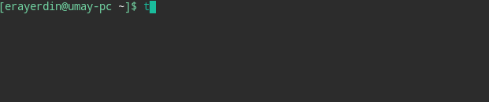

# tgcli

[![PyPI - Version][badge_version]][pypi_url]
[![PyPI - Downloads Last Month][badge_downloads]][pypi_url]
[![PyPI - Python Versions][badge_pyversions]][pypi_url]
[![PyPI - License][badge_license]][pypi_url]
[![Docs Status][badge_docs]][docs_url]
[![Code Style][badge_style]](https://github.com/ambv/black)



`tgcli` is a Python cli app for Telegram.

[pypi_url]: https://pypi.org/project/tgcli/
[docs_url]: https://tgcli.readthedocs.io

[badge_version]: https://img.shields.io/pypi/v/tgcli.svg?style=flat-square&logo=python&logoColor=white
[badge_downloads]: https://img.shields.io/pypi/dm/tgcli.svg?style=flat-square&logo=python&logoColor=white
[badge_pyversions]: https://img.shields.io/pypi/pyversions/tgcli.svg?style=flat-square&logo=python&logoColor=white
[badge_license]: https://img.shields.io/pypi/l/tgcli.svg?style=flat-square
[badge_docs]: https://img.shields.io/readthedocs/tgcli?style=flat-square
[badge_style]: https://img.shields.io/badge/style-black-000000.svg?style=flat-square


|              | Build | Coverage |
|--------------|-------|----------|
| **Master**   | [![Master Build][badge_build_master]][build_url] | [![Master Coverage][badge_coverage_master]][coverage_url] |
| **Development** | [![Development Build][badge_build_development]][build_url] | [![Development Coverage][badge_coverage_development]][coverage_url] |

[build_url]: https://travis-ci.com/erayerdin/tgcli
[coverage_url]: https://coveralls.io/github/erayerdin/tgcli

[badge_build_master]: https://img.shields.io/travis/com/erayerdin/tgcli/master.svg?style=flat-square&logo=travis&logoColor=white
[badge_build_development]: https://img.shields.io/travis/com/erayerdin/tgcli/development.svg?style=flat-square&logo=travis&logoColor=white
[badge_coverage_master]: https://img.shields.io/coveralls/github/erayerdin/tgcli/master.svg?logo=star&logoColor=white&style=flat-square
[badge_coverage_development]: https://img.shields.io/coveralls/github/erayerdin/tgcli/development.svg?logo=star&logoColor=white&style=flat-square

## Installing

### pip (No auto-update)

Install via `pip`:

```bash
pip install tgcli
```
### tgcli (Auto-update, Arch-based)

Also available as a package in [AUR](https://aur.archlinux.org/packages/tgcli/).

```bash
# assuming you use yay
yay -S tgcli
```

## Rationale

[A similar project](https://github.com/vysheng/tg), built on Python, was created by [@vysheng](https://github.com/vysheng), but it has not been updated since 2016 and considered abandoned. This tool *is not a fork* of the mentioned project, it is built from ground up.

## Example

For now, the use case is pretty simple. To send a message:

```bash
tgcli bot --token "BotToken" send --receiver "UserID" message "Your message"
```

You don't need to expose your token as flag. If you set
`TELEGRAM_BOT_TOKEN` environment variable, you do not need to set
`--token` flag. Just set it before using `tgcli`:

```bash
export TELEGRAM_BOT_TOKEN="BotToken"
```

You can get more information by doing:

```bash
tgcli bot send --help
```

Also, this repository uses notification from a private bot, you can see the
example Travis configuration [here](.travis.yml). Private `TELEGRAM_BOT_TOKEN`
and `TELEGRAM_RECEIVER` environment variables were set.

This application serves a really small purpose for now. It might face
breaking changes in the future.

## Documentation

Documentation has an intensive amount of  information about how to
use `tgcli`. Refer to the
[documentation][docs_url].
