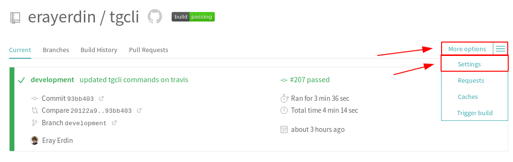
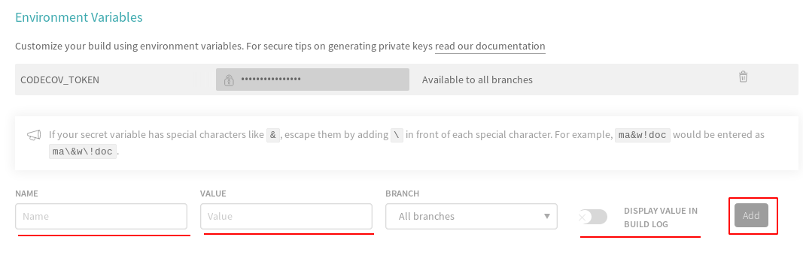

# Practical Usage

This page contains some examples about how to use `tgcli` practically.

## Getting Notifications about TravisCI Builds

You can receive notifications about your TravisCI builds with `tgcli`. Since it
is plain bash and you can use environment variables, you can use
[default environment variables][travisci_environment_variables]
of TravisCI in order to get extensive information about your builds. That means
you can give links to the related commit, branch, issue, pull request or the
build itself on the message as well because you can format your message with
either Markdown or HTML.

[travisci_environment_variables]: https://docs.travis-ci.com/user/environment-variables/#default-environment-variables

### Preparations

You need to prepare your environment in order to work with `tgcli`. The very
first step is to set up environment variables.

You can set up environment variables in your TravisCI builds and the good thing
is that these variables can be easily *obscured*.

!!! note
    This is pretty useful to us because we probably would like to hide the token
    of our bot and the ID number of the receiver.

We need to set up two variables beforehand, one is *your bot's token* and *the
user id of the receiver*. You can get your bot's token from [BotFather][bot_father]
and the id of the receiver from [UserInfoBot][user_info_bot].

We will set `TELEGRAM_BOT_TOKEN` with the token of our bot `TELEGRAM_RECEIVER`
with the id of the receiver. In order to do that, go to "Settings" on your
TravisCI project.



Then fill in the related fields on "Environment Variables" section.



!!! note
    Make sure "Display Value in Build Log" is turned off so that
    `TELEGRAM_BOT_TOKEN` and `TELEGRAM_RECEIVER` are not visible in the
    build log.

Now you are ready to go.

[bot_father]: https://t.me/BotFather
[user_info_bot]: https://t.me/userinfobot

### Getting A Grasp

Let's start with a simple example. Your jobs are built upon stages and a simple
stage with the usage of `tgcli` looks as below:

```yaml
 - stage: Your Stage Name
   install:
    # your other installations
    - pip install tgcli # or tgcli==X.Y.Z if you prefer a version
   script:
    - tgcli bot send -r $TELEGRAM_RECEIVER message "📏 Starting tests..."
    # do your testing here
   after_success:
    - tgcli bot send -r $TELEGRAM_RECEIVER message "✅ Tests are successful."
   after_failure:
    - tgcli bot send -r $TELEGRAM_RECEIVER message "📦🔥 Tests have failed!"
```

!!! tip
    You do not have to pass `TELEGRAM_BOT_TOKEN` variables explicitly since
    it is already used by `tgcli`.

### Customizing the Messages

TravisCI has many useful [environment variables][travisci_environment_variables]
built right in. You can use these environment variables to customize your
messages.

For instance, instead of we say plain "Starting tests..." when we start a job,
we can give URL to the current job as below:

```yaml
 - stage: Your Stage
 # other stuff
 script:
  - tgcli bot send -r $TELEGRAM_RECEIVER message "Starting job [#$TRAVIS_JOB_NUMBER]($TRAVIS_JOB_WEB_URL) of $TRAVIS_BUILD_STAGE_NAME stage..."
 # other stuff
```

This will give a link to your current job with the number of job and the name of
the stage.

!!! example
    Starting job [#207.4](https://travis-ci.com/erayerdin/tgcli/jobs/237169789) of Testing stage...